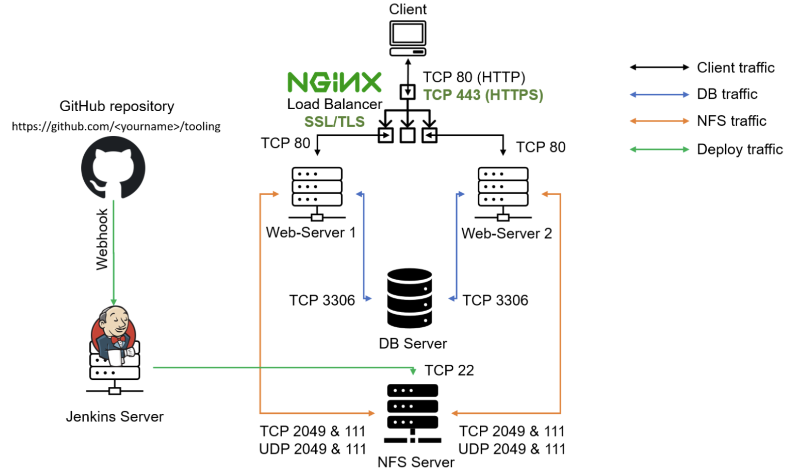

# Load Balancer Solution With Nginx and SSL/TLS

A Load Balancer (LB) distributes client requests across multiple Web Servers and helps ensure that traffic is distributed efficiently.

In this project, [Nginx](https://www.f5.com/go/product/welcome-to-nginx) is configured as a Load Balancer to distribute incoming HTTP/HTTPS traffic across multiple Web Servers.

It is also important to secure connections to Web Solutions so that information is encrypted while it is being transmitted. HTTPS provides this security by using TLS to encrypt communication between the client and the server.

## Task

This project consists of two parts:

1. Configure Nginx as a Load Balancer
2. Register a domain name and configure a secure connection using SSL/TLS certificates

The diagram below shows the architecture of the solution.



# Part 1 - Configure Nginx as a Load Balancer

### 1. Create an EC2 instance based on Ubuntu Server 24.04 LTS and name it `nginx LB`


**Open TCP port 80 for HTTP connections and TCP port 443 for HTTPS connections.**


Port 80 is required for HTTP traffic, while port 443 is required for HTTPS traffic. Both ports need to be allowed in the Security Group attached to the Nginx Load Balancer.

### 2. Update the `/etc/hosts` file with the Web Servers' names and private IP addresses

The `/etc/hosts` file provides local hostname-to-IP address mappings. This allows the Nginx server to resolve the Web Servers by the names defined in the file.

For example:

```text
<WEB_SERVER_1_PRIVATE_IP> web1
<WEB_SERVER_2_PRIVATE_IP> web2
```

**Access the Nginx Load Balancer instance:**

```bash
ssh -i "ec2key.pem" ubuntu@34.207.185.64
```

**Open the hosts file:**

```bash
sudo vi /etc/hosts
```


Add the private IP addresses and corresponding hostnames of the Web Servers.

### 3. Update the instance and install Nginx

**Update the instance:**

```bash
sudo apt update && sudo apt upgrade -y
```


**Install Nginx:**

```bash
sudo apt install nginx -y
```


### 4. Configure Nginx as a Load Balancer

The Web Servers can now be referenced using the hostnames defined in `/etc/hosts`.

This [blog](https://linuxize.com/post/how-to-edit-your-hosts-file/) provides additional information about the `/etc/hosts` file.

**Open the Nginx configuration file:**

```bash
sudo vi /etc/nginx/nginx.conf
```

**Add the following configuration inside the `http` section:**

```nginx
upstream myproject {
    server web1 weight=5;
    server web2 weight=5;
}

server {
    listen 80;
    server_name _;

    location / {
        proxy_pass http://myproject;
    }
}
```

The `upstream` block defines the group of backend Web Servers that will receive traffic.

Both servers have a weight of `5`, so they have equal weight when Nginx distributes requests using its default weighted round-robin method.

The `proxy_pass` directive forwards requests received by Nginx to the `myproject` upstream group.


**Test the Nginx configuration:**

```bash
sudo nginx -t
```


If the configuration is valid, Nginx should report that the syntax is okay and the configuration test is successful.

**Restart Nginx and check that the service is running:**

```bash
sudo systemctl restart nginx
sudo systemctl status nginx
```


At this point, Nginx is acting as a reverse proxy and Load Balancer, forwarding incoming requests to the Web Servers defined in the `myproject` upstream group.

# Part 2 - Register a Domain Name and Configure a Secure Connection Using SSL/TLS Certificates

A publicly resolvable domain name or hostname is required when obtaining a publicly trusted SSL/TLS certificate with Certbot.

For this project, the hostname used is:

```text
nginxlbtest.ddns.net
```

### 1. Register a domain name or obtain a publicly resolvable hostname

A domain name can be obtained through a domain registrar or a supported Dynamic DNS provider.

[my.noip.com](https://my.noip.com/) was used for this project.


### 2. Assign an Elastic IP to the Nginx Load Balancer

An Elastic IP provides a static public IPv4 address for the Nginx Load Balancer. This allows the DNS record to consistently point to the Load Balancer.


**Associate the Elastic IP with the Nginx Load Balancer:**


### 3. Create or update the DNS A record

Create or update an A record so that the domain/hostname points to the Elastic IP address assigned to the Nginx Load Balancer.


After updating the DNS record, verify that the hostname resolves to the correct public IP address.


### 4. Configure Nginx to recognize the domain name

Update the `server_name` directive in `nginx.conf` with the actual hostname.

**Open the Nginx configuration file:**

```bash
sudo vi /etc/nginx/nginx.conf
```

Update the server block to:

```nginx
server {
    listen 80;
    server_name nginxlbtest.ddns.net;

    location / {
        proxy_pass http://myproject;
    }
}
```

> **Important:** `server_name` must contain only the hostname. Do **not** include `http://` or `https://`.

Correct:

```nginx
server_name nginxlbtest.ddns.net;
```

Incorrect:

```nginx
server_name https://nginxlbtest.ddns.net;
```


**Restart Nginx:**

```bash
sudo systemctl restart nginx
```


**Test the Web Solution through the new domain name using HTTP:**

```text
http://nginxlbtest.ddns.net
```

At this stage, the connection is still using HTTP, so the browser may display a "Not Secure" warning. This is expected because TLS has not yet been configured.


### 5. Install Certbot and request an SSL/TLS certificate

[Certbot](https://certbot.eff.org/) is used to obtain and configure SSL/TLS certificates from Let's Encrypt.

**Check that `snapd` is available and running:**

```bash
sudo systemctl status snapd
```

If `snapd` is not installed, install it first:

```bash
sudo apt update
sudo apt install snapd -y
```

**Install Certbot using Snap:**

```bash
sudo snap install --classic certbot
```


### Request an SSL/TLS Certificate

Create a symbolic link so that the `certbot` command can be executed directly from the command line.

```bash
sudo ln -s /snap/bin/certbot /usr/local/bin/certbot
```

Certbot can then detect the Nginx configuration and obtain the certificate for the configured domain.

```bash
sudo certbot --nginx
```

During the process, Certbot will ask for the domain name and other required information. Make sure the domain has already been configured in `nginx.conf` and resolves to the Nginx Load Balancer.


The `--nginx` option allows Certbot to obtain the certificate and automatically update the Nginx configuration to enable HTTPS.

### Test HTTPS access

After Certbot has successfully configured the certificate, access the Web Solution using:

```text
https://nginxlbtest.ddns.net
```

HTTPS uses TCP port 443. If the certificate was successfully installed, the browser should show the secure connection indicator in the address bar.

The certificate details can also be viewed by clicking the security/lock icon in the browser.


### 6. Test automatic SSL/TLS certificate renewal

Let's Encrypt certificates are valid for 90 days. Certbot is designed to renew certificates automatically before they expire.

**Test the renewal process in dry-run mode:**

```bash
sudo certbot renew --dry-run
```


A successful dry run confirms that the renewal process can run successfully.

The Certbot Snap installation includes an automatic renewal mechanism through a cron job or systemd timer, so a separate custom cron job is normally not required.

You can check for the renewal timer with:

```bash
systemctl list-timers
```

> **Important:** Do not add the following command
>
> ```bash
> * */12 * * * root /usr/bin/certbot renew > /dev/null 2>&1
> ```
>
> When using `crontab -e`, the `root` field does not belong there because a user crontab contains five scheduling fields followed by the command.
>
> Since the Certbot Snap already provides automatic renewal, the custom cron entry can be omitted.

Resources on cron configuration:

[Job Scheduling (cronjob/crontab) on Linux CentOS 8](https://www.youtube.com/watch?v=4g1i0ylvx3A)

[Online cron expression editor](https://crontab.guru/)
